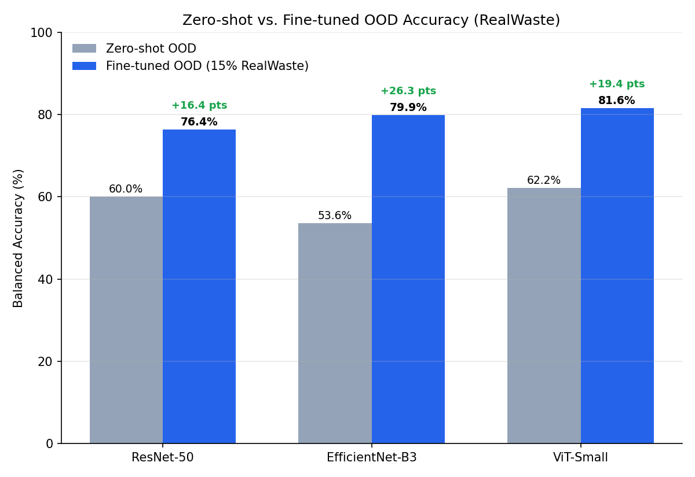
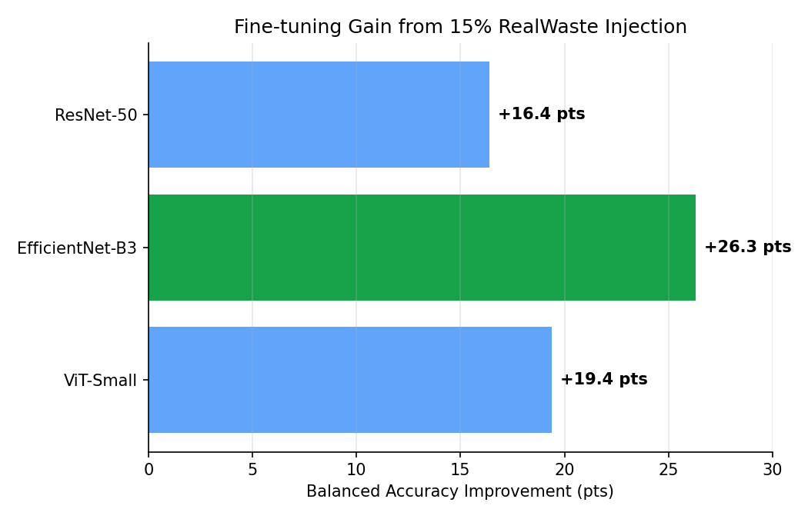

# Waste Classification — Domain Generalization Study

Master's project for xAI-Proj-M, Chair of Explainable Machine Learning, University of Bamberg.
Supervisor: Sebastian Doerrich.

**Final report:** [`report/ofu_xai_2022.pdf`](report/ofu_xai_2022.pdf)

## Project Goal

Train image classifiers to sort waste, then measure how well they generalize
from clean training data to real-world, out-of-distribution (OOD) images —
diagnose why the gap exists, and test whether it can be closed without using
any target-domain data in training.

## Datasets

**Training (combined, 18,042 images, 6-class baseline):**
- TrashNet — 2,527 images, clean white background
- Garbage Classification (12-class) — 15,515 images, mapped to our 6 classes

**OOD Testing (held out 100%, never used in training):**
- RealWaste — 4,752 images of real landfill waste
- TACO — 1,500 photos / 4,784 annotations of litter in natural/urban scenes
  (scope-boundary test; see Key Findings below)
- Own dataset — 170 images collected by the team, object-centric protocol

## Key Findings

**1. Baseline domain gap (6-class):** all three architectures lose 35-42%
balanced accuracy moving from clean data to RealWaste, zero-shot.

| Model | In-Distribution | OOD (RealWaste, zero-shot) | Domain Gap |
|---|---|---|---|
| ResNet-50 | 95.5% | 60.0% | -35.5 pts |
| EfficientNet-B3 | 96.0% | 53.6% | -42.4 pts |
| ViT-Small/16 | 97.4% | 62.2% | -35.2 pts |

**2. Two standard mitigation strategies made OOD accuracy worse**, not better:
heavier synthetic augmentation (-3.0 pts) and adding a third, more diverse
training dataset (-3.6 pts). Both increase in-distribution confidence without
improving transfer — evidence that data *type* matters more than quantity.

**3. A redesigned pipeline (5-class, border-background augmentation) improves
zero-shot RealWaste accuracy without ever using RealWaste in training:**

| Model | Zero-shot OOD (5-class, border-bg-aug) |
|---|---|
| ResNet-50 | 58.0% |
| EfficientNet-B3 | 53.8% |
| ViT-Small (lr=2e-5) | **64.5%** (best zero-shot result in the project) |

**4. Fine-tuning with a small slice of target-domain data closes most of the
domain gap.** Injecting just 15% of RealWaste into training (still holding
the rest out for evaluation) lifts all three architectures well past their
zero-shot OOD numbers, with ViT-Small reaching the best overall result:

| Model | Zero-shot OOD | Fine-tuned OOD (15% RealWaste) | Improvement |
|---|---|---|---|
| ResNet-50 | 60.0% | 76.4% | +16.4 pts |
| EfficientNet-B3 | 53.6% | 79.9% | +26.3 pts |
| ViT-Small | 62.2% | **81.6%** (best overall) | +19.4 pts |




EfficientNet-B3 benefits the most in absolute terms (+26.3 pts) despite
being the weakest zero-shot model, suggesting its failures were more about
missing exposure to real-world texture/lighting than an architectural
limitation. ViT-Small still wins on final accuracy, consistent with finding
5 below (best raw accuracy, worst calibration).

**5. TACO reveals a scope boundary, not a failure:** all three models collapse
to 33-39% on TACO regardless of mitigation — but converge to nearly the same
number, indicating a task-structure mismatch (object-centric classification
vs. in-context litter detection) rather than a generalization failure.
Addressing this would require a detection architecture (e.g. YOLO), out of
scope for this project.

**6. Calibration analysis reveals an accuracy/calibration trade-off:**
ViT-Small is the most accurate OOD model but the *worst* calibrated
(highest overconfidence, lowest OOD-detection AUROC); EfficientNet-B3 is
the reverse. This pattern reproduces across both RealWaste and the own
dataset — see `reports/reliability_diagram.png`.

**7. Statistical testing (Wilcoxon, McNemar)** confirms all architecture
differences on RealWaste (n=3,092) are significant. On the smaller own
dataset (n=142), not all differences reach significance — see the report
for the full breakdown.

Full experiment history: 38 logged experiments (EXP001-EXP035) in
`src/experiment_log.py`.

## Explainability (Grad-CAM)

Grad-CAM visualizations for all 3 models (5-class, border-bg-aug checkpoints)
on RealWaste are in `reports/`, alongside a before/after comparison showing
the effect of border-background augmentation on model attention, and
confusion matrices showing the dominant material-confusion patterns
(cardboard↔paper, glass↔plastic).

## Project Structure

```
src/
  datasets.py          - dataset loaders, class mappings
  models.py             - ResNet-50, EfficientNet-B3, ViT-Small builders
  train.py               - training loop, weighted loss, label smoothing
  evaluate.py            - OOD evaluation
  evauateor.py           - Khaled's evaluation utilities (TACO evaluator, batch printing)
  xai.py                  - Grad-CAM generation for all 3 models (stratified sampling)
  metrics.py             - balanced accuracy, domain gap, ECE/AUROC calibration,
                           Wilcoxon/McNemar significance testing
  config.py              - experiment configuration
  data_audit.py          - verifies train/val/test split and label consistency
  experiment_log.py      - full experiment history (EXP001-EXP035)
  evaluation_plan.py     - evaluation methodology documentation

evaluation_plan.md      - Khaled's evaluation methodology notes

notebooks/
  colab_5class_border_bg_aug_calibration.ipynb            - main pipeline: 5-class
    redesign, border-bg augmentation, calibration analysis
  colab_5class_border_bg_aug_calibration_wilcoxon.ipynb    - Wilcoxon/McNemar
    significance testing session
  khaled_evaluation_colab.ipynb                             - Khaled's evaluation
    methodology session
  (Kaggle credentials redacted; large embedded byte dumps from file-upload
  cells stripped to keep file sizes reasonable)

reports/
  class_distribution.png
  gradcam_resnet50_5class.png / gradcam_efficientnet_5class.png / gradcam_vit_5class.png
  before_after_resnet50.png
  confusion_matrices_realwaste.png
  reliability_diagram.png
  results_bar_chart_v2.png
  finetuning_comparison.png  - zero-shot vs. fine-tuned (15% RealWaste) OOD
                              accuracy, all 3 models
  finetuning_gain.png        - fine-tuning improvement magnitude by model

report/
  ofu_xai_2022.pdf        - final written report (compiled PDF)
  ofu_xai_2022.tex        - LaTeX source
  bibliography.bib, *.sty, math_*.tex  - LaTeX build dependencies
  figures/                - self-contained copy of the figures used in the
                           report, so it recompiles standalone without
                           depending on the reports/ folder above

app.py                    - Streamlit demo app: upload a trained checkpoint
                           and an image, get a live prediction + Grad-CAM
                           overlay (see "Interactive Demo" below)
```

## Interactive Demo

A Streamlit app (`app.py`) lets you try the models interactively:

```bash
pip install -r requirements.txt
python -m streamlit run app.py
```

Upload a trained checkpoint in the sidebar (architecture must match), then
upload a waste image to see the predicted class, confidence breakdown, and
a Grad-CAM heatmap of what the model focused on.

## How to Run

### Setup
```bash
pip install -r requirements.txt
```

### Data audit (verify split and class balance)
```bash
python src/data_audit.py --data_dir data/raw/trashnet
```

### Train a model
```bash
python src/train.py
```
Edit the CONFIG dict at the top of train.py to change model, epochs, or hyperparameters.

### OOD evaluation
```bash
python src/evaluate.py
```
Update CHECKPOINT_PATH and REALWASTE_ROOT at the bottom of the file to point
to your trained checkpoint and dataset location.

### Generate Grad-CAM visualizations
```bash
python src/xai.py --model resnet50 --checkpoint path/to/checkpoint.pth --realwaste path/to/RealWaste
```

### Reproducing exact results
Model checkpoints (`.pth` files) are stored in Google Drive rather than this
repository due to size. The Colab notebooks in `notebooks/` document the
exact training runs, code, and console output that produced every number
reported in `src/experiment_log.py` and the final report. Note that exact
reproduction of accuracy to the decimal point is not expected even with a
fixed seed, due to standard GPU non-determinism in deep learning training;
results within roughly 1-2 points of those logged are consistent with our
runs.

## Team

- Esmaeil Molapour — data pipeline, all model training, OOD evaluation,
  mitigation experiments, Grad-CAM/XAI, TACO analysis, own-dataset
  collection and evaluation, calibration analysis, statistical testing,
  report writing
- Khaled Ibrahim — evaluation methodology planning and documentation
  (`evaluation_plan.md`, `src/evaluation_plan.py`), TACO evaluator
  utilities (`src/evauateor.py`), calibration metric design
- Khawar Khan — experiment tracking infrastructure, architecture literature review
- Ashly Varghese — early augmentation experiment design
